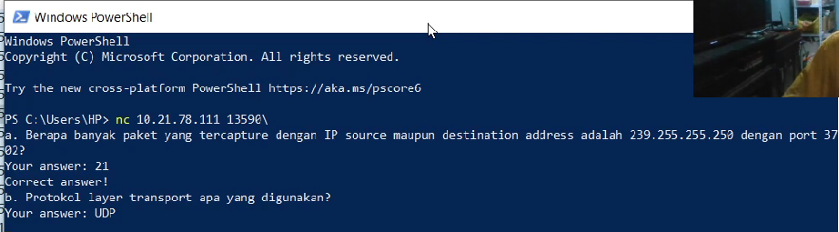

# Jarkom-Modul-1-D27-2023

Anggota Kelompok Jarkom D27:
* Duevano Fairuz Pandya (5025211052)
* Choirul Rijal Dawam Iba (5025211206)

# No. 1
### Soal
User melakukan berbagai aktivitas dengan menggunakan protokol FTP. Salah satunya adalah mengunggah suatu file.
a. Berapakah sequence number (raw) pada packet yang menunjukkan aktivitas tersebut?

b. Berapakah acknowledge number (raw) pada packet yang menunjukkan aktivitas tersebut? 

c. Berapakah sequence number (raw) pada packet yang menunjukkan response dari aktivitas tersebut?

d. Berapakah acknowledge number (raw) pada packet yang menunjukkan response dari aktivitas tersebut?

### Penyelesaian
Untuk mengetahui protokol FTP yang digunakan untuk mengupload file bisa menggunakan sintaks display filter berikut:

```ftp contains "STOR"```


setelah mengetahui file yang diupload, kita bisa lakukan display filter berikut untuk mengetahui `Request` dan `Response` nya

```ftp contains "zip"```


Untuk soal a dan b kita bisa lihat pada paket Request bagian berikut:


Sedangkan untuk soal b dan c kita bisa lihat pada paket Response bagian berikut:


Perolehan Flag:


----------------------------------------------------------------------------------------------------------------------------------
# No. 2
### Soal
Sebutkan web server yang digunakan pada portal praktikum Jaringan Komputer!

### Penyelesaian
Kita perlu mencari paket-paket dengan alamat IP portal praktikum yakni **10.21.78.111** menggunakan display filter berikut:

```ip.addr == 10.21.78.111```


setelah itu kita klik salah satu paket dan follow ke tcp streamnya


server yang dipakai adalah **gunicorn**

Perolehan Flag:


----------------------------------------------------------------------------------------------------------------------------------
# No. 3
### Soal
Dapin sedang belajar analisis jaringan. Bantulah Dapin untuk mengerjakan soal berikut:
a. Berapa banyak paket yang tercapture dengan IP source maupun destination address adalah 239.255.255.250 dengan port 3702

b. Protokol layer transport apa yang digunakan?

### Penyelesaian
Lakukan display filter sesuai alamat IP soal sebagai berikut:

```ip.addr == 239.255.255.250```


lalu kita bisa lihat protocol layer yang digunakan adalah **UDP** (jawaban soal b), sehingga bisa kita tambahkan ke display filter menjadi:
```ip.addr == 239.255.255.250 and udp.port == 3702```


setelah itu dapat kita hitung total paket nya yakni **21** (jawaban soal a)

Perolehan Flag:


----------------------------------------------------------------------------------------------------------------------------------
# No. 4
### Soal
Berapa nilai checksum yang didapat dari header pada paket nomor 130?

### Penyelesaian
Kita cukup scroll hingga menemukan paket nomor 130 lalu buka deskripsi TCP nya seperti berikut:


nilai checksum yang dimaksud adalah: **0x18e5**

Perolehan Flag:


----------------------------------------------------------------------------------------------------------------------------------
# No. 5
### Soal
Elshe menemukan suatu file packet capture yang menarik. Bantulah Elshe untuk menganalisis file packet capture tersebut.
a. Berapa banyak packet yang berhasil di capture dari file pcap tersebut?

b. Port berapakah pada server yang digunakan untuk service SMTP?

c. Dari semua alamat IP yang tercapture, IP berapakah yang merupakan public IP?

### Penyelesaian
Di soal nomor 5 ini kita tidak mendapatkan **kode netcat** nya secara langsung, jadi untuk menyelesaikannya 
* Pertama-tama kita download file **.zip** yang disediakan soal
* Lalu kita cari **password** nya dengan cara mencari file / paket yang unik yang ada di file pcap, berikut ini adalah paket yang unik


* Buka tcp stream dan scroll hingga menemukan clue password


* Decode password **NWltcGxlUGFzNXdvcmQ=** menggunakan base64

PASSWORD: **5implePas5word**

* Setelah itu ekstrak file zip, dan kita mendapatkan kode netcat nya yakni `nc 10.21.78.111 11111`

* Untuk menyelesaikan soal a kita cukup scroll dan lihat total paket nya yakni **60** (jawaban soal a)
* Untuk menyelesaikan soal b kita cukup klik salah satu paket dengan protokol SMTP

port yang digunakan adalah port **25** (jawaban soal b)

* Untuk menyelesaikan soal c, karena hanya ada dua alamat IP di file capture tersebut kita cukup coba satu persatu, sehingga IP address yang dimaksud adalah **74.53.140.153** (jawaban soal c)

Perolehan Flag:


----------------------------------------------------------------------------------------------------------------------------------
# No. 6
### Soal
Seorang anak bernama Udin Berteman dengan SlameT yang merupakan seorang penggemar film detektif. sebagai teman yang baik, Ia selalu mengajak slamet untuk bermain valoranT bersama. suatu malam, terjadi sebuah hal yang tak terdUga. ketika udin mereka membuka game tersebut, laptop udin menunjukkan sebuah field text dan Sebuah kode Invalid bertuliskan **"server SOURCE ADDRESS 7812 is invalid"**. ketika ditelusuri di google, hasil pencarian hanya menampilkan **a1 e5 u21**. jiwa detektif slamet pun bergejolak. bantulah udin dan slamet untuk menemukan solusi kode error tersebut.

### Penyelesaian
Karena di soal diketahui **SOURCE ADDRESS 7812** maka kita cari paket nomor 7812 dan lihat alamat ip source nya

alamat ip yang dimaksud adalah: **104.18.14.101**

Selanjutnya kita terjemahkan alamat ip tersebut menggunakan clue yang diberikan soal yakni **a1 e5 u21**

Kode error yang dimaksud: **JDRNJA**

Perolehan Flag:


----------------------------------------------------------------------------------------------------------------------------------
# No. 7
### Soal
Berapa jumlah packet yang menuju IP 184.87.193.88?

### Penyelesaian
Kita cukup lakukan sintaks display filter berikut:
```ip.dst == 184.87.193.88```


Jumlah paket yang menuju IP tersebut adalah **6**

Perolehan Flag:


----------------------------------------------------------------------------------------------------------------------------------
# No. 8
### Soal
Berikan kueri filter sehingga wireshark hanya mengambil semua protokol paket yang menuju port 80! (Jika terdapat lebih dari 1 port, maka urutkan sesuai dengan abjad)

### Penyelesaian
Untuk menyelesaikkan soal no 8 di `filter` wireshark ketik `tcp.dtsport == 80 || udp.dstport == 80 ` sehingga di temukan jawaban yang benar seperti gambar dibawah


----------------------------------------------------------------------------------------------------------------------------------
# No. 9
### Soal
Berikan kueri filter sehingga wireshark hanya mengambil paket yang berasal dari alamat 10.51.40.1 tetapi tidak menuju ke alamat 10.39.55.34!

### Penyelesaian
Untuk mencari alamat `10.51.40.1` yaitu dengan cara `ip.src == 10.51.40.1` di tambah konjungsi `&&` dan untuk mencari alamat yang tidak ingin kita cari dengan cara `ip.dst != 10.39.55.34`, jika digabung seperti   `ip.src == 10.51.40.1 && ip.dst != 10.39.55.34` sehingga di dapatkan jawaban yang benar seperti gambar di bawah


----------------------------------------------------------------------------------------------------------------------------------
# No. 10
### Soal
Sebutkan kredensial yang benar ketika user mencoba login menggunakan Telnet!

### Penyelesaian
Untuk mencari user yang melakukan login ,pertama 

```Telnet```


Setelah itu akan muncul tampilan `User` dan `password`


